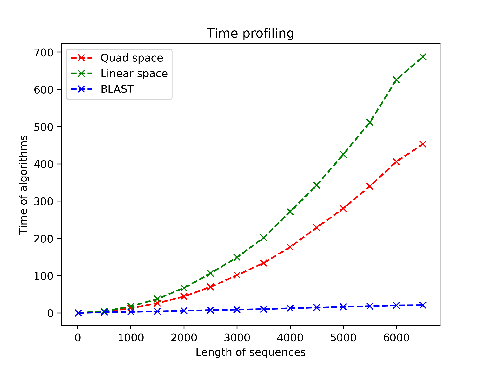
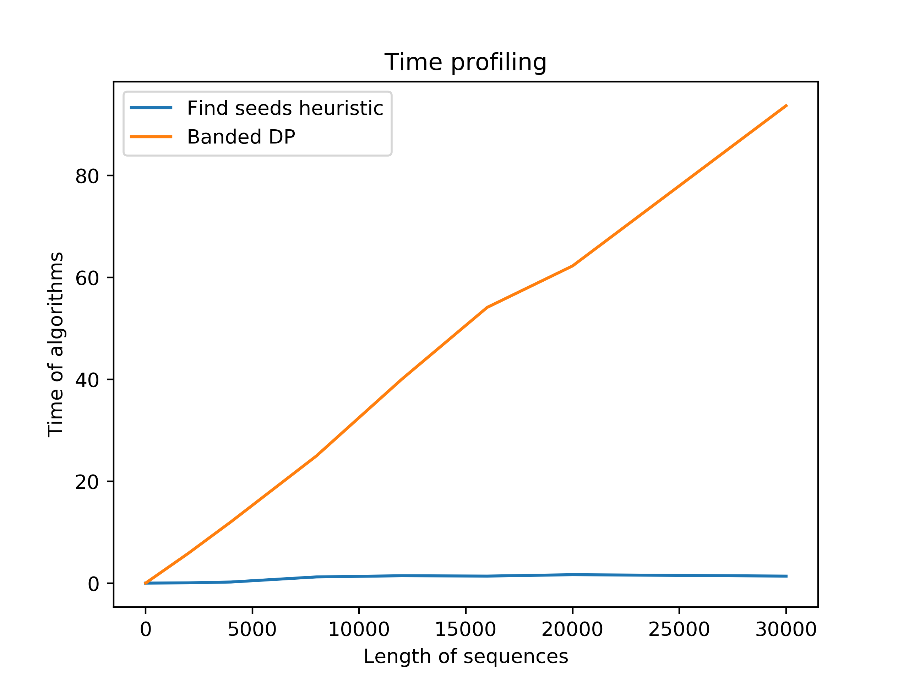

# Bioinformatics Coursework:

# Local Sequence Alignment
```bash
$ python LocalSearch_DynProg_Hirshberg_Heuristic.py
```

# LocalSearch_DynProg_Hirshberg_Heuristic.py contains the following functions:
## dynprog
Quadratic space and time dynamic programming algorithm.
## dynproglin
Linear space and quadratic time dynamic programming algorithm.
## heuralign
Linear space and linear time heuristic algorithm I made, it works in a similar way to BLAST and FASTA.




# MyScoreFunction.py contains the function described in [Q-MyScoreFunction.pdf]MyScoreFunction.pdf:
